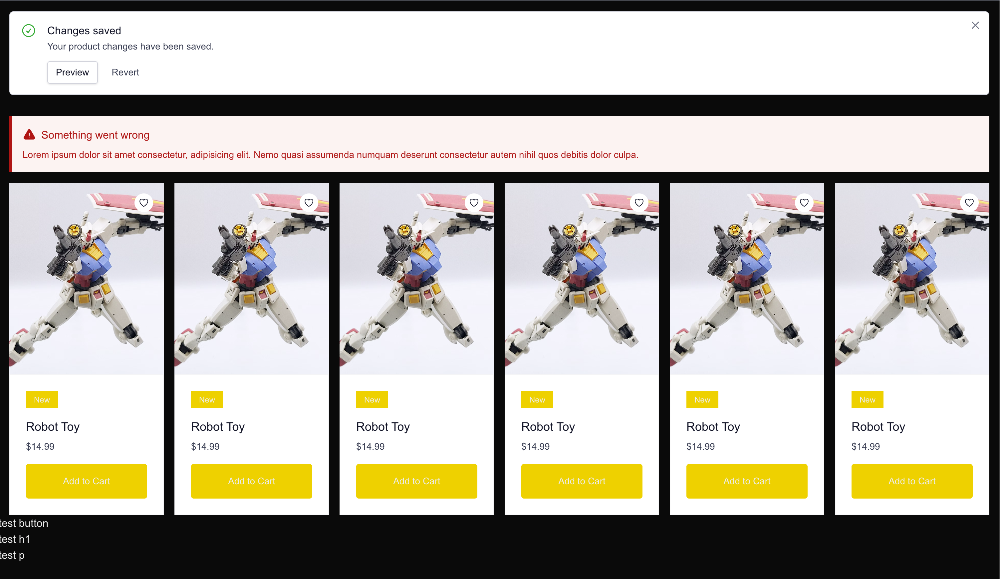
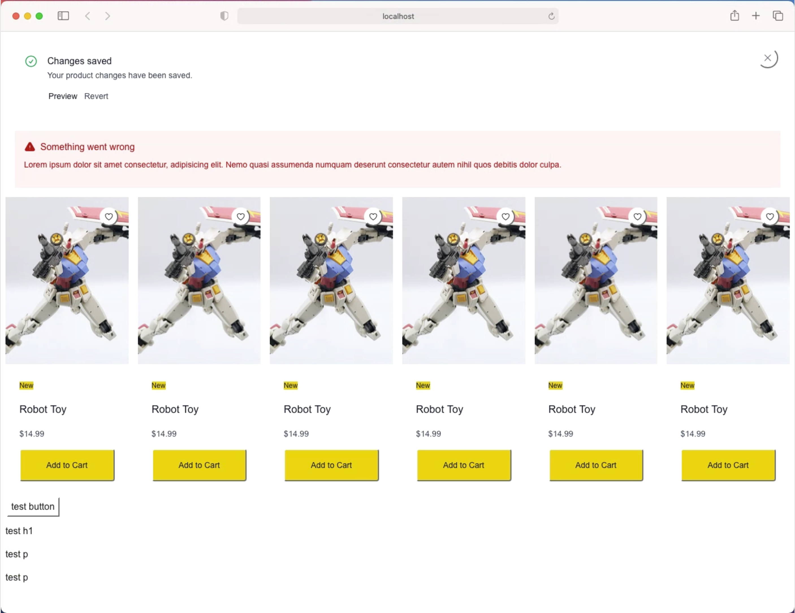
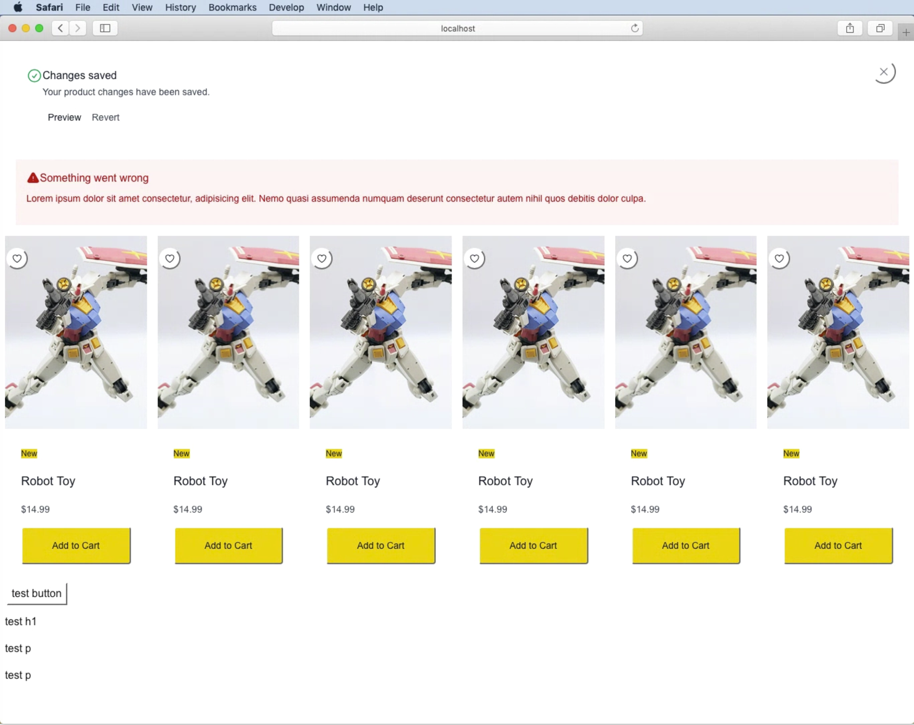

Showcase of what tailwind 4 looks like in older browser with and without postcss polyfills.
There is this [gist](https://gist.github.com/alexanderbuhler/2386befd7b6b3be3695667cb5cb5e709) of custom polyfills but it is not working with next :/

How it should look like:

How it looks like in safari 14 and 12:

How it looks like in safari 14 and 12 with postcss polyfills:

